# TP Git — tpgit

Report on a hands-on Git and GitHub exercise (versioning, branches, merges, conflict resolution, and collaborative work).

## Description

This project is a practice repository (`tpgit`) created as part of the "Introduction to the GIT" lab (UM6P). It served as a training ground for handling Git end to end: initializing a repository, managing simple list files (`fruits.txt`, `vegetables.txt`, `sauces.txt`, `spices.txt`, `herbs.txt`), creating and merging branches, resolving conflicts (including an encoding-related one), connecting to a remote repository on GitHub, and finally working collaboratively as a team.

GitHub repository: [github.com/momo226-code/tpgit-](https://github.com/momo226-code/tpgit-)

## Authors

- **Mohamed Idriss NANA**
- **Taha Thiam**

## Objectives

- Learn how to use a version control system (Git).
- Master versioning of a software project.
- Share a project and work as a team via GitHub.

---

## 1. Installing and Configuring Git

Git was first installed from [git-scm.com](https://git-scm.com/downloads), then verified with:

```powershell
git --version
```

Git identity (name + email) was then configured, since Git attaches it to every commit:

```powershell
git config --global user.name "Your Name"
git config --global user.email "your.email@example.com"
```

## 2. Initializing the Local Repository

A `tpgit` folder was created and turned into a Git repository with `git init`. A first file, `fruits.txt`, was created and then tracked using the classic cycle **status → add → commit → status → log**.

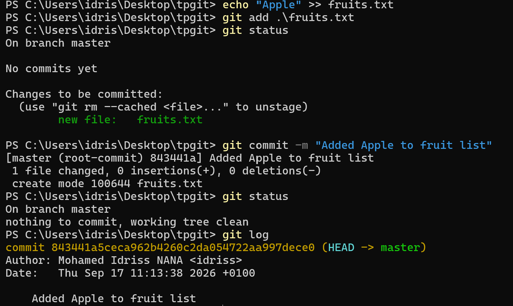
*First commit: adding "Apple" to `fruits.txt`, with status checked before and after.*

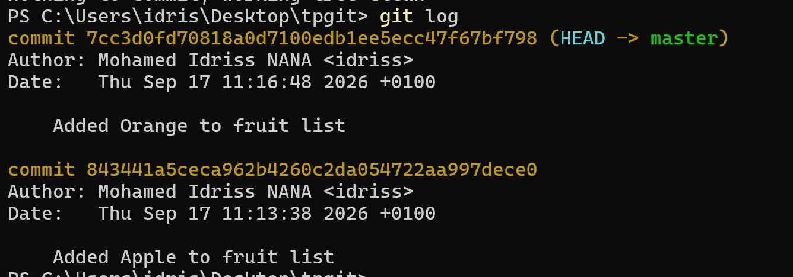
*Adding "Orange": a new add → commit cycle.*

Three additional commits followed the same pattern (Banana, Lemon, Ananas), each visible in the detailed history:

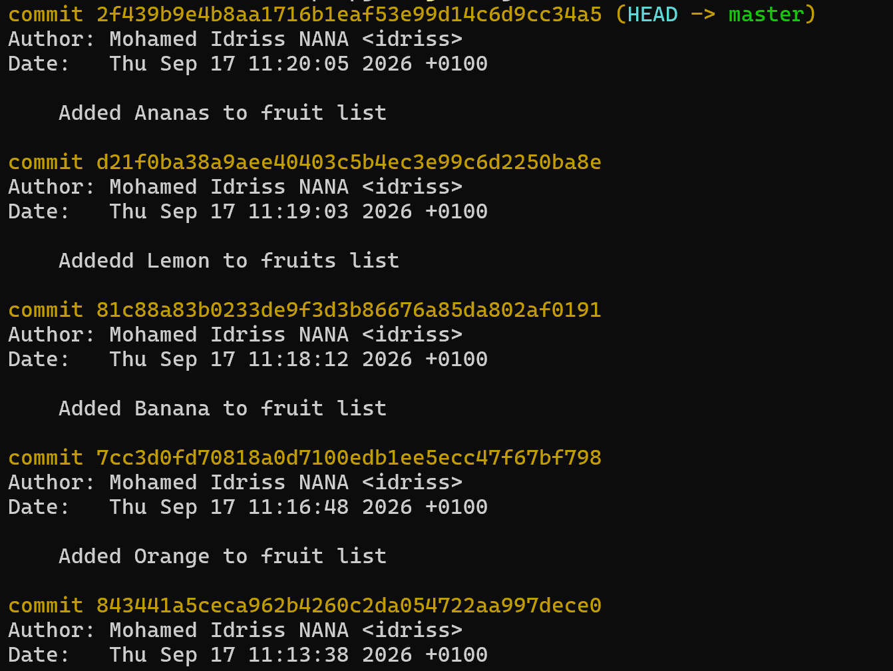
*`git log`: each commit shows its hash, author, date, and message.*

## 3. Branches

### `vegetables` branch

A `vegetables` branch was created and switched to using `git branch` / `git checkout`, then a `vegetables.txt` file was added and built up through 3 separate commits (Tomato, Cucumber, Carrot).

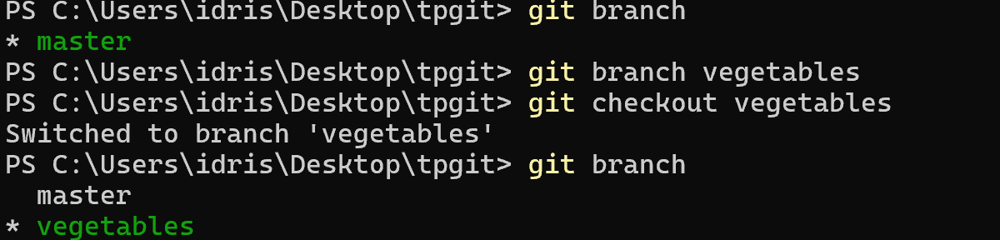
*Creating and switching to the `vegetables` branch, confirmed with `git branch`.*

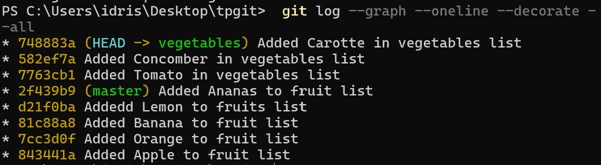
*`git log --graph --oneline --decorate --all`: the `vegetables` branch diverged from `master` after the "Ananas" commit.*

### `sauces` branch

The same approach was used for the `sauces` branch, with a `sauces.txt` file built up through the "SauceArrachide" and "Djoumblé" commits.

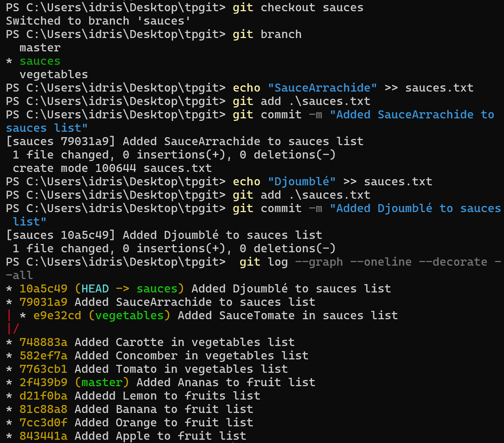
*Creating the `sauces` branch and its first two commits, with the full graph showing the divergence of the `sauces` and `vegetables` branches from `master`.*

### `spices` and `herbs` branches (paired work)

Each member of the pair worked on their own branch (`spices` for Mohamed Idriss, `herbs` for Taha), with their own files and commits, before merging into `main`.

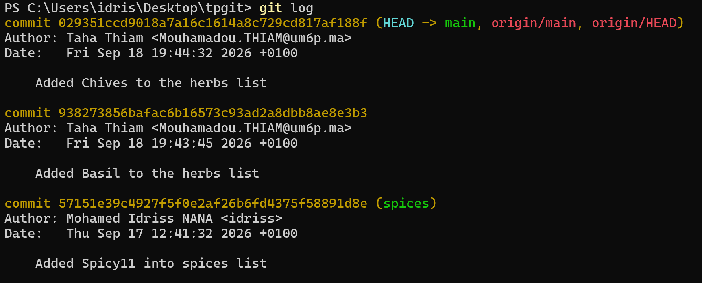
*Detailed `git log` showing each contributor's commits on their respective branches.*

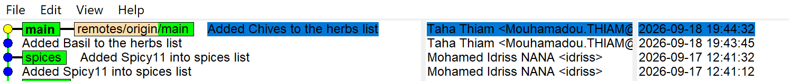
*Graphical visualization (gitk) of the parallel progress on the `spices` and `herbs` branches before they were merged into `main`.*

## 4. Merges

Once work was finished on each branch, merges were performed into `master`/`main`, following the principle: **check out the destination branch, then `merge` the source branch into it**.

```powershell
git checkout main
git pull
git merge <branch>
git push origin main
```

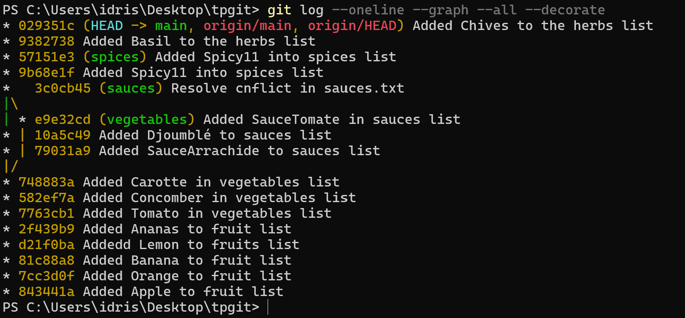
*Final graph showing the `vegetables` and `sauces` branches merged into `main` via a merge commit.*

## 5. Conflict Resolution

Two kinds of conflicts came up during the lab and were resolved.

### a) A classic content conflict (`vegetables.txt`)

After deleting "Carotte" locally while a different change existed on the remote, a conflict appeared when running `git pull`:

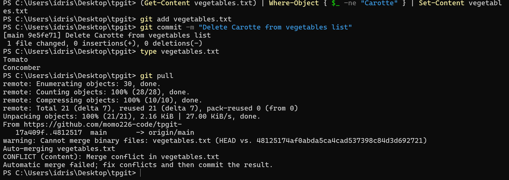
*`CONFLICT (content): Merge conflict in vegetables.txt` after a `git pull`.*

### b) An encoding-related conflict (`sauces.txt`)

A more unusual case came up with `sauces.txt`: Git reported `Cannot merge binary files`, even though it was really a text file. The root cause was **UTF-16 encoding** (with a BOM), generated by default by PowerShell when writing with `echo >>`, which Git interprets as binary and cannot merge line by line.

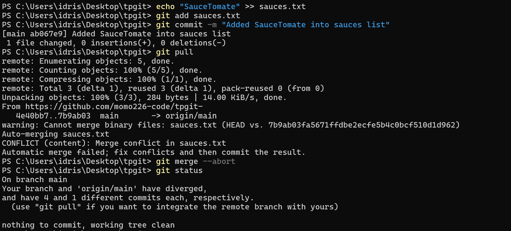
*A `git pull` attempt triggering a binary-file conflict, followed by `git merge --abort` (cleanly cancelling the attempt, without fixing the underlying issue) and confirmation of the branch divergence (`git status`).*

**Solution applied**: the file was manually rewritten from scratch in UTF-8, then the conflict was explicitly resolved:

```powershell
Remove-Item sauces.txt
"SauceArrachide" | Set-Content sauces.txt -Encoding utf8
"Djoumblé"        | Add-Content sauces.txt -Encoding utf8
"SauceTomate"     | Add-Content sauces.txt -Encoding utf8

git add sauces.txt
git commit -m "Resolve conflict in sauces.txt and fix encoding to UTF-8"
git pull
```

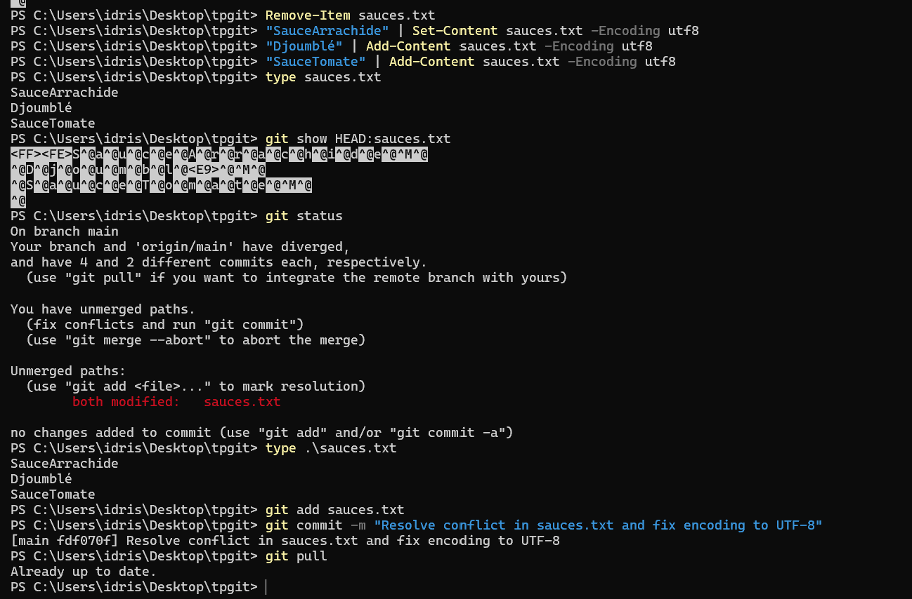
*Rewriting the file in UTF-8, `git add` + `git commit` to close the conflict, then `git pull` confirming everything is in sync (`Already up to date`).*

> **Key takeaway**: cleanly rewriting a file on disk isn't enough — until `git add` is run, Git still considers the conflict unresolved.

## 6. Managing Files (Adding / Removing Items)

Several standard operations were practiced on `fruits.txt`: adding new items (Grenadille, Fraise, Papaye) and removing a specific line without an editor, directly from PowerShell.

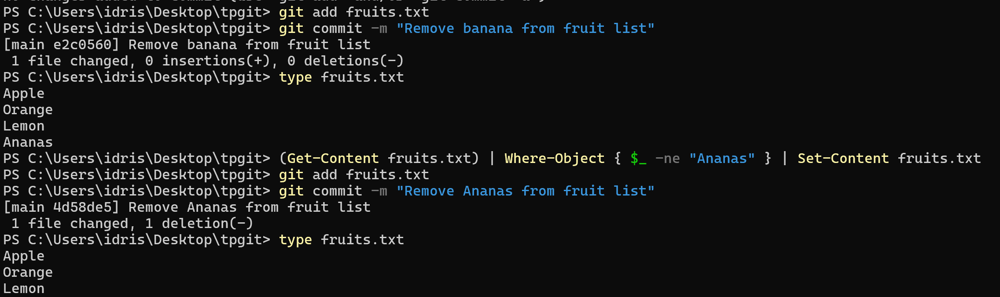
*Removing "Banana" and then "Ananas" using `Where-Object { $_ -ne "..." }`, without opening a text editor.*

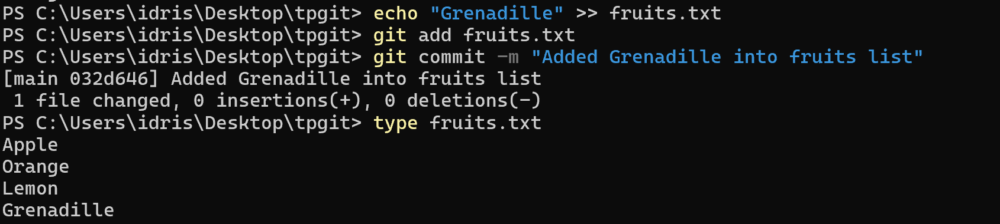
*Adding "Grenadille" to the list, followed by a dedicated commit.*

## 7. Remote Repository (GitHub)

The local repository was linked to a remote repository created on GitHub, then synced via `push`/`pull`:

```powershell
git remote add origin https://github.com/momo226-code/tpgit-.git
git push -u origin main
```

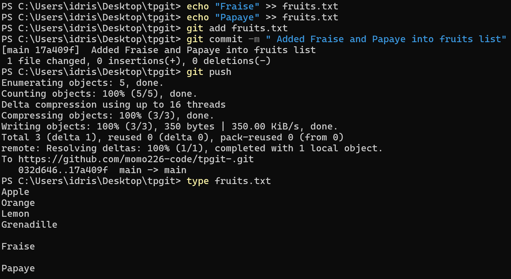
*Sending local commits to the remote `tpgit-` repository on GitHub.*

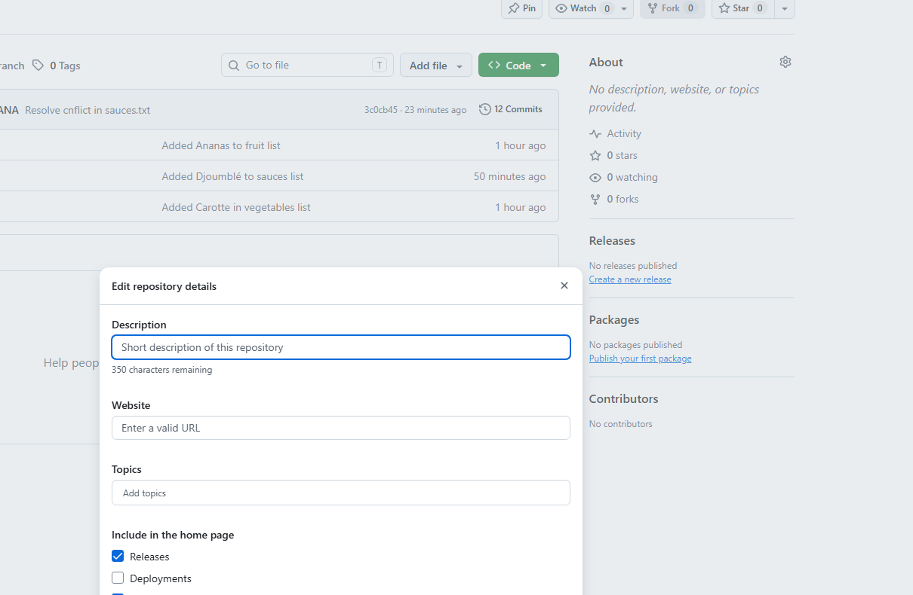
*The `tpgit` repository visible online on GitHub, with its commit history.*

A final check of the local and remote branches confirmed that `main` was indeed the default branch and fully synced:

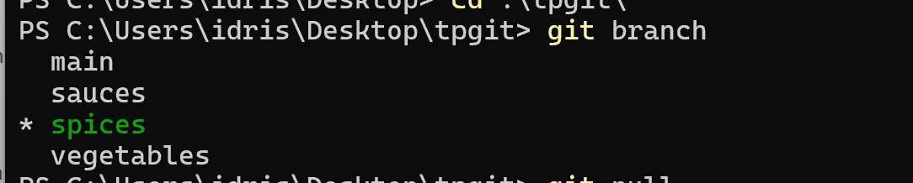
*`git branch`: local branches `main`, `sauces`, `spices`, `vegetables`, with `origin/main` as the remote reference.*

## 8. Collaborative Work

Both members of the pair (Mohamed Idriss NANA and Taha Thiam) were added as collaborators on the GitHub repository (Settings → Collaborators → Add people), allowing each of them to push directly to the shared project.

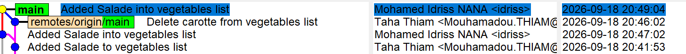
*gitk visualization of the `main` branch showing commits from both authors, with timestamps and identities.*

Each contributor worked on their own branch before merging their work into `main` — mirroring a realistic team workflow: isolating work in progress, then integrating it once it's finished and tested.

---

## Issues Encountered

| Problem | Cause | Solution |
|---|---|---|
| `fatal: unable to auto-detect email address` | Git identity not configured | `git config --global user.name/user.email` |
| `cannot do a partial commit during a merge` | Trying to commit a single file while a merge was in progress | `git add .` (stage everything) before committing |
| `Cannot merge binary files: sauces.txt` | File written in UTF-16 (via `echo >>` in PowerShell), interpreted as binary by Git | Rewriting the file in UTF-8 with `Set-Content -Encoding utf8` |
| Conflict reappearing after `git merge --abort` | `--abort` cancels the merge attempt but never resolves the underlying disagreement | Redo the `pull`/`merge` and actually resolve the conflict (edit + `add` + `commit`) |

## Conclusion

This lab made it possible to work hands-on through the full Git lifecycle: from locally tracking a simple text file to collaborating with a partner on a remote repository, including branch creation, merging, and conflict resolution — even an unusual conflict caused by file encoding on Windows/PowerShell. These exercises closely mirror the workflow used day to day on a real team development project.

## Resources

- [Official Git Documentation](https://git-scm.com/book/en/v2)
- [Learn Git Branching](https://learngitbranching.js.org/)
- [Try GitHub](https://try.github.io/)
